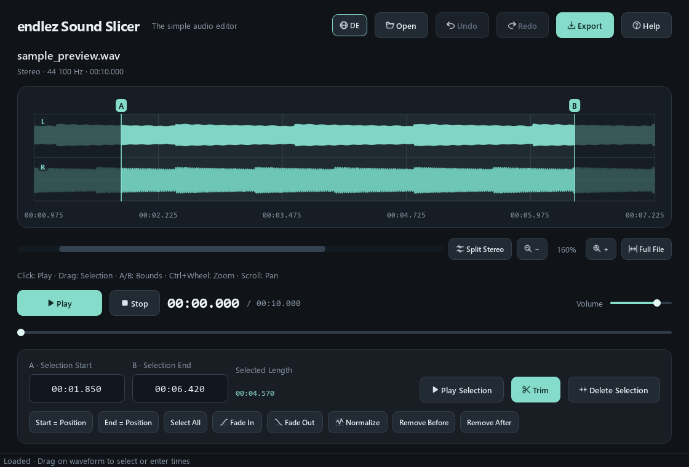

# endlez Sound Slicer

A fast, lightweight, and modern desktop audio editor for Windows built with Python, PySide6, and FFmpeg.




---

## Features

- **Precision Waveform Navigation:** Smooth zoom from 100% up to 10,000% centered at cursor (`Ctrl + Mouse Wheel`), middle-click panning, overview mini-map, and horizontal scrollbar.
- **Dual-Channel Stereo View:** Dedicated Left & Right channel waveforms with zero-crossing axes, plus a one-click toggle back to combined mono/mixdown view.
- **Non-Destructive Multi-Undo:** 25-level history stack (`Ctrl + Z` / `Ctrl + Y`) with descriptive tooltips for every step.
- **Cutting & Trimming Tools:** Crop selection, delete range (`Ctrl + X`) with seamless click-free splice, remove audio before/after markers, and millisecond-accurate inputs.
- **DSP & Audio Effects:** S-curve Fade In / Fade Out, peak normalization to -0.1 dBFS.
- **9 Supported Formats:**
  - *Lossless (24-bit PCM):* WAV, FLAC, AIFF via SoundFile.
  - *Compressed:* MP3 (VBR Q2), M4A (192 kbps faststart), AAC, OGG Vorbis, Opus (128 kbps), and WMA via bundled FFmpeg.
- **Bilingual Interface:** Instant live language switch between English and German (`EN` / `DE`).
- **Integrated Help System (`F1`):** Searchable documentation and shortcut reference directly inside the app.

---

## Quick Start

### 1. Installation

```powershell
# Clone the repository
git clone https://github.com/endlez/endlezSoundSlicer.git
cd endlezSoundSlicer

# Create virtual environment and install dependencies
python -m venv .venv
.\.venv\Scripts\pip install -r requirements.txt
